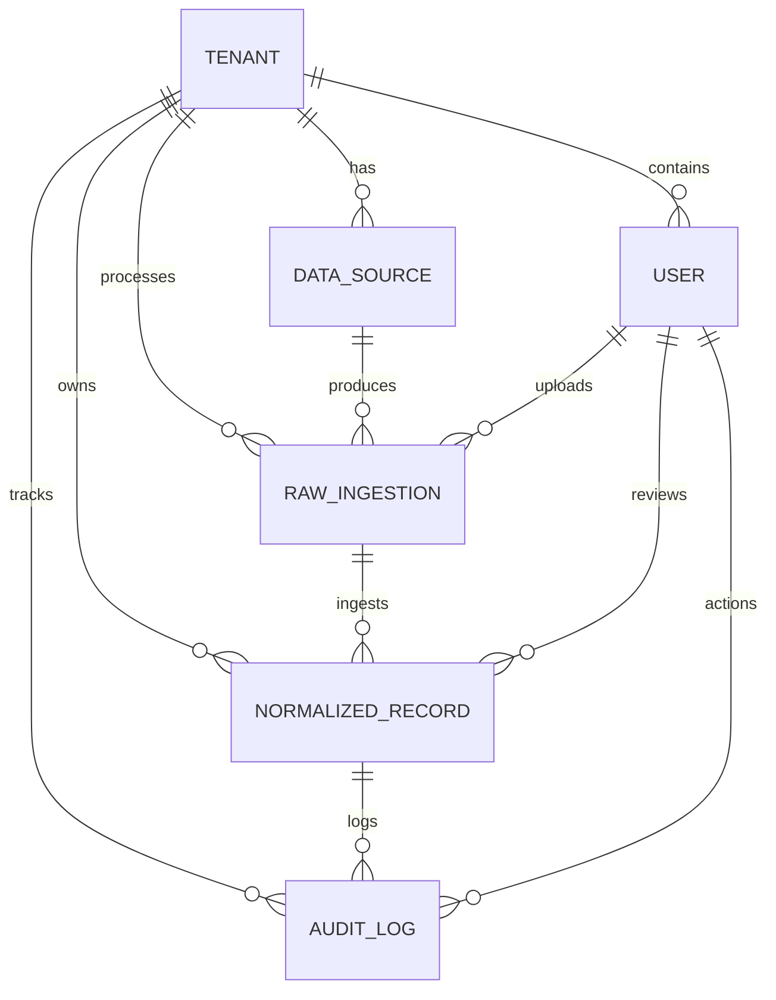

# Data Model Documentation — Breathe ESG

This document details the architecture of our multi-tenant carbon accounting database schema. Our design is optimized for high auditable standards, data normalization, and comprehensive change history.

---

## 1. Schema Diagram & Relationships

---

## 2. Model Detail Specifications

### A. Tenant (`accounts.Tenant`)
We enforce **multi-tenancy at the database layer** using foreign keys. All active queries restrict records to the logged-in user's tenant context.
- `id` (BigAutoField): Primary key
- `name` (CharField): Corporate company name (unique)
- `created_at` / `updated_at`: Timestamps

### B. User (`accounts.User`)
Custom user model extending Django's abstract user to attach user roles and tenancy.
- `email` (EmailField): Primary authentication field (unique)
- `tenant` (ForeignKey → Tenant): Enforces company membership
- `role` (CharField): Choices: `admin` (super-admin), `analyst` (view, edit, ingest, flag, approve), `auditor` (view dashboard, download logs, audit)

### C. Data Source (`ingestion.DataSource`)
Configuration tracking individual active system exports or feeds.
- `tenant` (ForeignKey → Tenant)
- `name` (CharField): e.g., "SAP Procurement", "PG&E Portal"
- `source_type` (CharField): Choices: `sap` (Scope 1), `utility` (Scope 2), `travel` (Scope 3)

### D. Raw Ingestion (`ingestion.RawIngestion`)
Represents the original input files ingested. Tracks pipeline logs and retains the source of truth.
- `tenant` (ForeignKey → Tenant)
- `data_source` (ForeignKey → DataSource)
- `file_name` (CharField): Name of the uploaded file
- `raw_data_url` (URLField): Direct secure cloud URL (e.g. Cloudinary/S3 link to original file)
- `status` (CharField): `pending`, `processing`, `success`, `failed`
- `error_message` (TextField): Pipeline error messages if parsing fails

### E. Normalized Record (`records.NormalizedRecord`)
Our unified transaction ledger where all activity data is converted to carbon footprint.
- `tenant` (ForeignKey → Tenant)
- `raw_ingestion` (ForeignKey → RawIngestion): Traceable back to the original uploaded file row
- `source_row_index` (IntegerField): Exact row index in original CSV (strict audit capability)
- `date` (DateField): The calendar period or allocation date
- `scope` (CharField): `Scope 1`, `Scope 2`, `Scope 3`
- `category` (CharField): Normalized activity category (e.g., Purchased Electricity, SAP Fuel - Diesel)
- `original_value` / `original_unit` (Decimal / Char): Original parsed quantity (e.g., 4000 Gallons)
- `normalized_value` / `normalized_unit` (Decimal / Char): Standard base quantity (e.g., 15141.6 Liters)
- `co2e_kg` (Decimal): Carbon footprint calculated in kilograms of CO₂e
- `location` (CharField): Grid location or origin/destination mapping
- `review_status` (CharField): Choices: `pending`, `approved`, `rejected`, `suspicious`
- `suspicious_reason` (TextField): Details explaining anomalous consumption warnings

### F. Audit Log (`audit.AuditLog`)
Immutable change logger tracking compliance modifications.
- `tenant` (ForeignKey → Tenant)
- `record` (ForeignKey → NormalizedRecord)
- `user` (ForeignKey → User): Operator who did the action
- `action` (CharField): `CREATE`, `UPDATE`, `APPROVE`, `REJECT`, `FLAG`
- `old_value` / `new_value` (TextField): Tracks field differences if manually edited (compliance auditable)
- `comments` (TextField): Manual notes inputted by analysts

---

## 3. Key Normalization Rationale

- **Source-to-Record Traceability**: By storing `raw_ingestion` and `source_row_index` in every `NormalizedRecord`, auditors can trace any single carbon record back to the exact row and file uploaded by the analyst months prior.
- **Unit Separation**: Preserving both `original` and `normalized` quantities lets corporate analysts double-check records against paper utility invoices without doing complex mental conversions.
